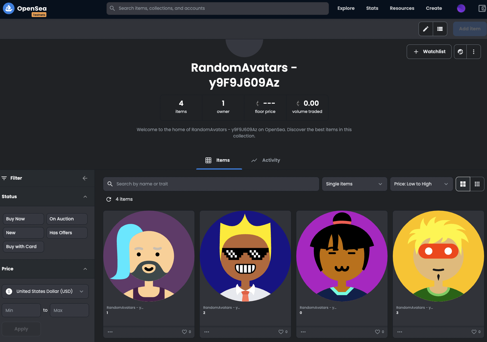

# Random Avatars for Blockchain Academy Solidity Course certification

## Table of Contents
* [Overview](#Overview)
* [Instructions to run this project](#Instructions-to-run-this-project)
    * [Installing Node.js and NPM](#Installing-Node.js-and-NPM)
    * [Running the project with Hardhat](#Running-the-project-with-Hardhat)
    * [Setting up your environment](#Setting-up-your-environment)
    * [Getting a wallet's signer private key](#Getting-a-wallet's-signer-private-key)
    * [Getting an Infura Project ID](#Getting-an-Infura-Project-ID)
    * [Getting a Chainlink Subscription ID](#Getting-a-Chainlink-subscription-ID)
    * [Deploying the smart contract](#Deploying-the-smart-contract)
    * [Adding the deployed smart contract to VRF Subscription](#Adding-the-deployed-smart-contract-to-VRF-Subscription)
* [Verify contract in Etherscan](#Verify-contract-in-Etherscan)
* [Mint NFT](#mint-nft)
* [Adding contract to Rinkeby OpenSea](#Adding-contract-to-Rinkeby-OpenSea)
* [Testing](#Testing)
* [References](#References)

## Overview
This is the final project for the Blockchain Academy Solidity Course. In this project we mint NFTs using the ERC721 standard using the [Multiavatar](https://api.multiavatar.com/) avatar library for our images, we also integrate Chainlink by using its Chainlink VRF (Verifiable Randomness Function) to get a non-deterministic random number that will determine the avatar that the user mints. We also create a UI for the user for minting the NFT and seeing all minted NFTs. Everything runs on the Rinkeby test network.

The project is divided in two repositories.
1. The smart contract for the minting of NFTs. (This repository)
2. The dApp using React.js, built for interaction with the smart contract in a user-friendly way. (Repository available [here](https://github.com/georgetegral/RandomAvatarsInterface))

## Instructions to run this project
To run this project we will use the Hardhat IDE, which needs you to install Node.js and NPM. Finally, we will also need a Chainlink account with Testnet LINK tokens.

### Installing Node.js and NPM
Use the following link to install Node.js in your computer: https://nodejs.org/en/download/, follow the instructions in the website.

At the end, you can verify that the installation was correct by running the following commands

```bash
node -v
npm -v
```

### Running the project with Hardhat
First we have to install hardhat in our system. You can install Hardhat with the following command:

```bash
npm install --save-dev hardhat
```

After installing Hardhat, install the project dependencies using the following command:

```bash
npm install
```

The following dependencies should be installed:
- @nomiclabs/hardhat-waffle
- @nomiclabs/hardhat-ethers
- chai
- dotenv
- ethereum-waffle
- ethers
- hardhat
- @chainlink/contracts
- @openzeppelin/contracts

### Setting up your environment
You will need to define your environment variables in an .env file, you will need this 3 values:
1. DEPLOYER_SIGNER_PRIVATE_KEY
2. INFURA_PROJECT_ID
3. CHAINLINK_SUBSCRIPTION_ID

In the project files you will find an .env.example so that you only paste the required values, we will now get the necessary values.

### Getting a wallet's signer private key
To sign transactions and deploy the smart contract, you will need to input your wallet's private key in the .env file.

To do this, you need the Metamask extension, if you don't have one yet, you can download it [here](https://chrome.google.com/webstore/detail/metamask/nkbihfbeogaeaoehlefnkodbefgpgknn). Please setup your wallet and save your private key before continuing.

To get the signer private key open the Metamask extension and go to your account -> "The 3 dots menu" -> Account details -> Export Private Key -> Input your password -> Copy your signer private key.

The key should start with "0x", if you have it then paste it in your .env file after DEPLOYER_SIGNER_PRIVATE_KEY. We are ready to continue with the next step.

### Getting an Infura Project ID
We are going to need to create a free Infura project, go to the [Infura website](https://infura.io/) and set up a free account, after creating your account please go to the Dashboard and create a new project, after creating it look at the keys section, in "Endpoints" select Rinkeby, and finally copy the Project ID and paste it in your .env file after INFURA_PROJECT_ID.

We are ready for the next step.

### Getting a Chainlink Subscription ID
We will be using the Chainlink Verifiable Randomness Function to get a non-deterministic random number to mint our NFT. 

We will need Testnet LINK tokens, to get them you will need to set your Metamask wallet to the Rinkeby test network and copy your wallet address, then go to the [Chainlink Faucet](https://faucets.chain.link/rinkeby) and get some LINK tokens and some test Ethereum.

After you have some test LINK tokens, now you will have to register in the [Chainlink VRF Portal](https://vrf.chain.link/) and create a new subscription with your wallet address, fund your subscription with the LINK tokens you just got.

Finally you can add consumers, but we will add them later because we first need to deploy our smart contract so that we can get the contract's address.

### Deploying the smart contract
We are ready to deploy our smart contract, we will be using the ```deploy.js``` file in the scripts folder, there we can define the maximum number for our NFTs, by default it has 10,000, but you can edit it to be higher or lower.

To deploy the contract in the Rinkeby test network, run the following command:

```bash
npx hardhat run scripts/deploy.js --network rinkeby
```

If the deployment was successful, you will get the following output (with different addresses):
```bash
Deploying contract with the account: 0x59D37a8d2A08E2A6F3352ff561052d08B546D203
RandomAvatars is deployed at: 0x65c4797eE66af314984abE8aC0BB07a6Ff2ce84d
```

You can go to the [Rinkeby Etherscan](https://rinkeby.etherscan.io/) to check the deployed contract.

### Adding the deployed smart contract to VRF Subscription
Now that you have the deployed contact address, you can go back to the [Chainlink VRF Portal](https://vrf.chain.link/) and in the consumers section you can click in "Add Consumer" and add the address of your smart contract.

After that is done you are ready to use your contract!

## Verify contract in Etherscan
Even though we will be using a UI to interact with our contract, we are able to use Etherscan to verify our contract and interact with our functions, to do this you have to go to [Rinkeby Etherscan](https://rinkeby.etherscan.io/) and in the search bar input your contract address, after that select the contract tab, and click "Verify and Publish", you will enter a [website to verify your contract](https://rinkeby.etherscan.io/verifyContract), you will need to input your configuration for the project, here's what I used:
- Please enter the Contract Address you would like to verify: 0x65c4797eE66af314984abE8aC0BB07a6Ff2ce84d
- Please select Compiler Type: Solidity (Single File)
- Please select Compiler Version: v0.8.7
- Please select Open Source License Type: MIT

After that, you will need to input your smart contract as a single file, to do this go to your Hardhat project and run the following command:

```bash
npx hardhat flatten > Flattened.sol 
```

After that, you will get a new file named "Flattened.sol", you will copy this file and paste it as the Contract Source Code, but before you do that, go to your "Flattened.sol" file and remove all the license definitions except for the first one.

In my case, I had "SPDX-License-Identifier: MIT", and there where another 16 definitions for the license, you have to remove them all except for the first one.

After doing that, copy and paste your source code, and click "Verify and Publish", you will see a message that the code was successfully verified.

Finally, go back to your contract in Etherscan and in the "Contract" tab, you will see a green checkmark, and 3 new options, "Code", "Read Contract", and "Write Contract".

## Mint NFT
To test the mint functionality, go to "Write Contract", then select "Connect to Web3", select Metamask, and finally select the "mint" option and click "Write".

The mint will take up to 3 minutes, this is because we make a request to Chainlink for a random number, and it will be served the next Ethereum block, just wait for a bit and you can verify that the Mint was successful.

## Adding contract to Rinkeby OpenSea
With the NFT minted, we can add our contract to Opensea to see our minted NFTs, to do this, go to [Get Listed on OpenSea Rinkeby](https://testnets.opensea.io/get-listed) and select "Live on a testnet", after that, put your contract address and it will load your NFT collection.



## Testing
Tests are defined in the test folder

To run them you can run the following command:

```bash
npx hardhat test
```

We defined 2 tests that should be passing, but feel free to add more as you wish.

## References
- [Multiavatar](https://api.multiavatar.com/)
- [Node.js](https://nodejs.org/en/download/)
- [Hardhat](https://hardhat.org/tutorial/creating-a-new-hardhat-project.html)
- [Metamask Extension Download](https://chrome.google.com/webstore/detail/metamask/nkbihfbeogaeaoehlefnkodbefgpgknn)
- [Infura website](https://infura.io/)
- [Chainlink](https://chain.link/)
- [Chainlink Verifiable Randomness Function](https://vrf.chain.link/)
- [Testnet LINK Faucet](https://faucets.chain.link/rinkeby)
- [Rinkeby Etherscan](https://rinkeby.etherscan.io/)
- [Rinkeby Etherscan Verify Contract](https://rinkeby.etherscan.io/verifyContract)
- [OpenSea Rinkeby](https://testnets.opensea.io/get-listed)